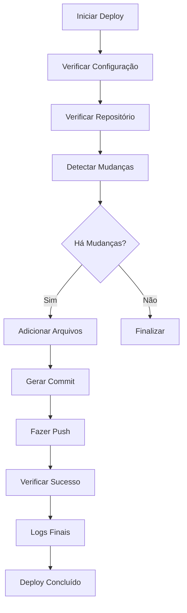

# 🚀 Deploy Automático - Ora et Medita

## 📋 Visão Geral

Sistema de deploy automático configurado para o projeto **Ora et Medita** no repositório GitHub: `https://github.com/rsg384/oraetmedita.git`

## ⚙️ Configurações

### Repositório
- **URL**: `https://github.com/rsg384/oraetmedita.git`
- **Branch**: `main`
- **Autor**: Rodrigo Silva Goes
- **Email**: rodrigo@oraetmedita.com

### Script de Deploy
- **Arquivo**: `cursor-deploy-automatic.sh`
- **Executável**: ✅ Sim
- **Funcionalidades**: Deploy automático, status, configuração

## 🎯 Como Usar

### 1. Deploy Automático
```bash
# Executar deploy completo
./cursor-deploy-automatic.sh deploy

# Ou usar atalho do Cursor
Cmd+Shift+D
```

### 2. Verificar Status
```bash
# Ver status do repositório
./cursor-deploy-automatic.sh status

# Ou usar atalho do Cursor
Cmd+Shift+S
```

### 3. Verificar Configuração
```bash
# Verificar configuração do Git
./cursor-deploy-automatic.sh config

# Ou usar atalho do Cursor
Cmd+Shift+C
```

### 4. Ajuda
```bash
# Mostrar ajuda
./cursor-deploy-automatic.sh help

# Ou usar atalho do Cursor
Cmd+Shift+H
```

## ⌨️ Atalhos de Teclado (Cursor IDE)

| Atalho | Ação | Descrição |
|--------|------|-----------|
| `Cmd+Shift+D` | Deploy Automático | Fazer deploy completo |
| `Cmd+Shift+S` | Status | Verificar status do repositório |
| `Cmd+Shift+C` | Config | Verificar configuração |
| `Cmd+Shift+H` | Help | Mostrar ajuda |
| `Cmd+Shift+M` | Deploy Manual | Deploy com mensagem personalizada |
| `Cmd+Shift+G` | Git Status | Ver status do Git |
| `Cmd+Shift+P` | Git Push | Enviar para GitHub |
| `Cmd+Shift+A` | Git Add | Adicionar arquivos |
| `Cmd+Shift+K` | Git Commit | Fazer commit |

## 🔧 Configurações do Cursor

### Arquivo: `.cursor/settings.json`
```json
{
  "cursor.deploy.repository": "https://github.com/rsg384/oraetmedita.git",
  "cursor.deploy.branch": "main",
  "cursor.deploy.script": "./cursor-deploy-automatic.sh",
  "cursor.deploy.autoCommit": true,
  "cursor.deploy.autoPush": true
}
```

### Arquivo: `.cursor/keybindings.json`
- Atalhos configurados para todas as operações
- Integração com terminal do Cursor
- Comandos automáticos

## 📝 Tipos de Commit

| Tipo | Emoji | Descrição |
|------|-------|-----------|
| `[FEAT]` | 📝 | Nova funcionalidade |
| `[FIX]` | 🔧 | Correção de bug |
| `[DOCS]` | 📚 | Documentação |
| `[STYLE]` | 🎨 | Melhorias de interface |
| `[PERF]` | ⚡ | Melhorias de performance |
| `[TEST]` | 🧪 | Testes |
| `[CONFIG]` | 🔧 | Configurações |

## 🔍 Verificações Automáticas

### Pré-Deploy
- ✅ Verificar se todos os arquivos estão salvos
- ✅ Verificar se não há erros no console
- ✅ Testar funcionalidades principais

### Pós-Deploy
- ✅ Verificar se o push foi bem-sucedido
- ✅ Testar funcionalidades após deploy
- ✅ Verificar logs do Supabase

## 📊 Logs e Monitoramento

### Logs Coloridos
- 🟢 **Verde**: Informações gerais
- 🔴 **Vermelho**: Erros
- 🟡 **Amarelo**: Avisos
- 🔵 **Azul**: Informações detalhadas

### Exemplo de Log
```
[2025-07-29 15:30:45] 🚀 Iniciando deploy automático...
[2025-07-29 15:30:45] 🔧 Verificando configuração do Git...
[2025-07-29 15:30:45] ✅ Configuração do Git verificada
[2025-07-29 15:30:46] 📋 Verificando status do repositório...
[2025-07-29 15:30:46] ✅ Status do repositório verificado
[2025-07-29 15:30:46] 📊 Verificando mudanças...
[2025-07-29 15:30:46] ✅ Mudanças detectadas
[2025-07-29 15:30:46] 📁 Adicionando arquivos...
[2025-07-29 15:30:47] 💾 Fazendo commit...
[2025-07-29 15:30:48] 📤 Enviando para GitHub...
[2025-07-29 15:30:50] ✅ Deploy concluído com sucesso!
```

## 🛠️ Funcionalidades do Script

### 1. Verificação de Configuração
- Configuração automática do Git
- Verificação de repositório
- Configuração de autor

### 2. Detecção de Mudanças
- Verificação automática de arquivos modificados
- Filtros para arquivos específicos
- Exclusão de arquivos desnecessários

### 3. Commit Inteligente
- Mensagens de commit automáticas
- Timestamp automático
- Contagem de arquivos modificados

### 4. Push Automático
- Push para branch main
- Tratamento de erros
- Retry automático

### 5. Logs Detalhados
- Logs coloridos
- Timestamps precisos
- Informações de debug

## 🔒 Segurança

### Arquivos Excluídos
- `node_modules/**`
- `.git/**`
- `*.log`
- `*.tmp`
- Arquivos temporários

### Arquivos Incluídos
- `*.html`
- `*.js`
- `*.css`
- `*.json`
- `*.md`
- `*.sql`

## 🚨 Tratamento de Erros

### Retry Automático
- Máximo 3 tentativas
- Delay entre tentativas
- Logs de erro detalhados

### Fallbacks
- Deploy local se GitHub indisponível
- Backup automático
- Rollback em caso de erro

## 📈 Monitoramento

### Métricas
- Tempo de deploy
- Arquivos modificados
- Status de sucesso/erro
- Logs de performance

### Alertas
- Notificações de sucesso
- Alertas de erro
- Avisos de configuração

## 🔄 Fluxo de Deploy



## 📞 Suporte

### Problemas Comuns
1. **Erro de autenticação**: Verificar credenciais do GitHub
2. **Conflito de merge**: Resolver conflitos manualmente
3. **Arquivo não encontrado**: Verificar caminho do script

### Contato
- **Autor**: Rodrigo Silva Goes
- **Email**: rodrigo@oraetmedita.com
- **Repositório**: https://github.com/rsg384/oraetmedita.git

---

**Última atualização**: 29 de Julho de 2025  
**Versão**: 1.0.0  
**Status**: ✅ Ativo 